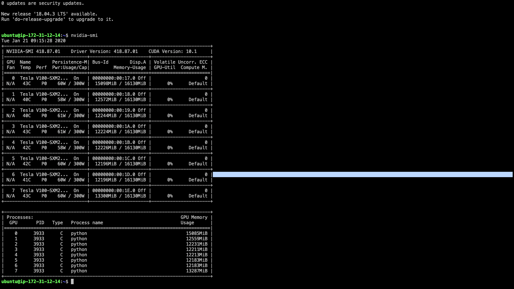

# Error while training pspnet upon cityscapes

## Description
When using pspnet in the semantic segmentation library of gluoncv to train on Cityscapes, the program was stuck for a short time after the program started running upon MXNet 1.5.1 or 1.6.0. Checking the GPU status shows that the memory is used but no program is running. I would like to ask how to solve this problem.

By the way, due to the use of the functions in Iterm2 (when idle, send ascii code 0 every 60 seconds) to keep the connection with server, so each `@` means waited 60 seconds, so the figure could show the problems clearly.




## Environment
- AWS Deep Learning AMI (Ubuntu 16.04) Version 26.0
- GPU instance p3.16xlarge; GPU: 64; memory: 488 GiB
- conda 4.8.1
- python: 3.6.5
- mxnet-cu101=1.5.1
- mxnet-cu101: 1.6.0b20191122
- gluoncv 0.6.0

## To Reproduce
1. setup environment
  ```
  source activate mxnet_p36
  pip install mxnet-cu101==1.5.1 (or 1.6.0b20191122)
  pip install gluoncv
  ```
2. download cityscapes dataset follow in https://gluon-cv.mxnet.io/build/examples_datasets/cityscapes.html

3. running train scripts
```
cd ~/
git clone https://github.com/dmlc/gluon-cv.git
cd gluon-cv/scripts/segmentation/
python train.py --dataset citys --model psp --aux --backbone resnet101 --syncbn --ngpus 8 --lr 0.01 --epochs 240 --base-size 2048 --crop-size 768 --workers 32
```
