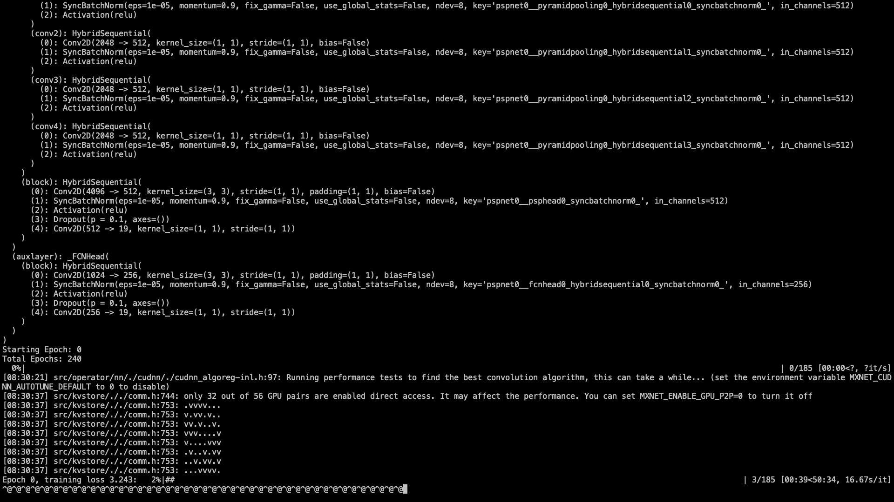

# Error when training PSPNet on Cityscapes dataset using GluonCV

## Description

The problem is when I train a PSPNet using GluonCV semantic segmentation library on the Cityscapes dataset, the training will stuck (hang) right after it started. Checking the GPU status shows that the memory is used but no program is running, GPU utilization is 0. The screenshot is attached below.


By the way, due to the use of the functions in Iterm2 (when idle, send ascii code 0 every 60 seconds) to keep the connection with server, so each `@` means waited 60 seconds. The figure below could show the stuck problem more clearly.



This "hang" situation happens for both MXNet 1.5.1 and 1.6.0. But the training is fine using MXNet 1.4.1.


## Environment
- AWS Deep Learning AMI (Ubuntu 16.04) Version 26.0
- GPU instance p3.16xlarge; GPU: 64G; memory: 488 GiB
- conda 4.8.1
- python: 3.6.5
- mxnet-cu101\==1.5.1 or mxnet-cu101==1.6.0b20191122
- gluoncv: 0.6.0

## To Reproduce
1. Setup environment
  ```
  source activate mxnet_p36
  pip install mxnet-cu101==1.5.1 (or 1.6.0b20191122)
  pip install gluoncv
  ```
2. Download cityscapes dataset following https://gluon-cv.mxnet.io/build/examples_datasets/cityscapes.html

3. Run training command,
```
cd ~/
git clone https://github.com/dmlc/gluon-cv.git
cd gluon-cv/scripts/segmentation/
python train.py --dataset citys --model psp --aux --backbone resnet101 --syncbn --ngpus 8 --lr 0.01 --epochs 240 --base-size 2048 --crop-size 768 --workers 32
```

## What have you tried to solve it?
- I tried to train the same network on other datasets like ADE20K, there is no problem.
- I tried to reduce the crop size from 768 to 480 in the command line above using MXNet 1.5.1, there is no problem.
- I tried MXNet 1.4.1, there is no problem.

So I suspect starting from MXNet 1.5.0, there are some changes that lead to this situation, we can't handle large input/tensor. An input of 768x768x3 will hang, but an input of 480x480 will go through.
